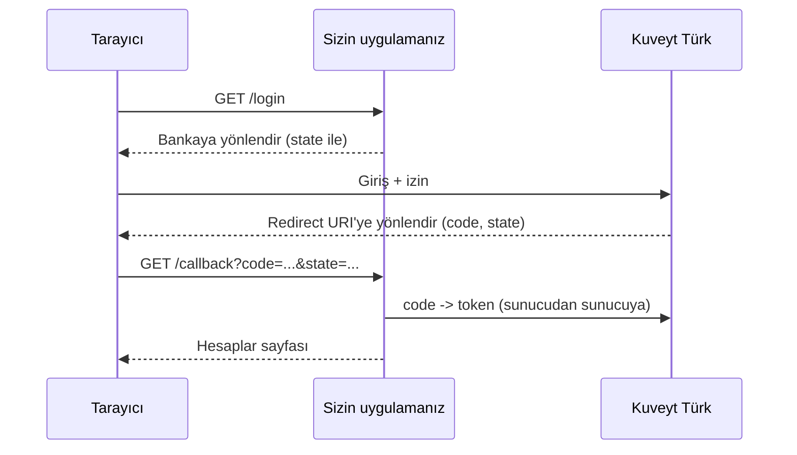

# Web uygulamasında müşteri girişi

Bu sayfa, sitenize "Kuveyt Türk ile bağlan" düğmesi eklemeyi anlatır. Depodaki
`examples/web_app` klasöründe aynı akışı uygulayan, çalışır durumda bir Flask uygulaması vardır.

## Akış



## Kod

```python
import secrets
from flask import Flask, redirect, request, session, url_for
from kuveytturk_api import AuthenticationError, AuthorizationRequiredError, KuveytTurk

kt = KuveytTurk.from_env(".env", token_store=veritabani_token_deposu)
app = Flask(__name__)
app.secret_key = "..."  # sabit ve gizli olmalı

def ziyaretci() -> str:
    # Kendi üyelik sisteminiz varsa burada kullanıcı kimliğini kullanın.
    session.setdefault("ziyaretci", secrets.token_urlsafe(16))
    return session["ziyaretci"]

@app.get("/login")
def login():
    session["oauth_state"] = kt.auth.new_state()
    return redirect(kt.auth.authorization_url(["accounts", "offline_access"],
                                              state=session["oauth_state"]))

@app.get("/callback")
def callback():
    try:
        code = kt.auth.parse_callback(request.url, state=session.pop("oauth_state", None))
        kt.auth.exchange_code(code, user=ziyaretci())
    except AuthenticationError as hata:      # izin reddedildi, state uyuşmadı, kod geçersiz
        return f"Bağlanılamadı: {hata}", 400
    return redirect(url_for("hesaplar"))

@app.get("/hesaplar")
def hesaplar():
    try:
        yanit = kt.as_user(ziyaretci()).tpp_accounts.account_list_v2()
    except AuthorizationRequiredError:       # token yok ya da refresh token'ın süresi doldu
        return redirect(url_for("login"))
    return {"hesaplar": yanit["accountList"]}
```

Callback rotasının yolu, portaldaki **Redirect URI** ile birebir aynı olmalıdır.

## Güvenlik kontrol listesi

- [x] `state` her girişte yeniden üretilir, oturumda saklanır ve callback'te doğrulanır;
  kullanıldıktan sonra silinir.
- [x] Token'lar sunucuda saklanır; tarayıcıya (çereze, sayfaya, URL'ye) asla gitmez. Çerezde
  yalnızca ziyaretçiyi tanıyan rastgele bir anahtar durur.
- [x] Her müşterinin token'ı kendi anahtarıyla saklanır ve `kt.as_user(...)` ile kullanılır.
- [x] Çıkış (`logout`) `POST` ile yapılır ve token'ı depodan siler.
- [x] Canlıda Redirect URI `https://` olur, oturum çerezi `Secure` ve `HttpOnly` işaretlenir.
- [x] Birden çok süreç ya da sunucu varsa token'lar ortak bir depoda (veritabanı, Redis) ve
  şifreli tutulur. Refresh token her yenilemede değiştiği için depoya yazma güvenilir olmalıdır.

## Örneği çalıştırmak

```bash
pip install kuveytturk-api flask
python examples/web_app/app.py
```

Uygulama, `.env` içindeki `KUVEYTTURK_REDIRECT_URI` adresinin portunda açılır
(ör. `http://localhost:8000/`).
